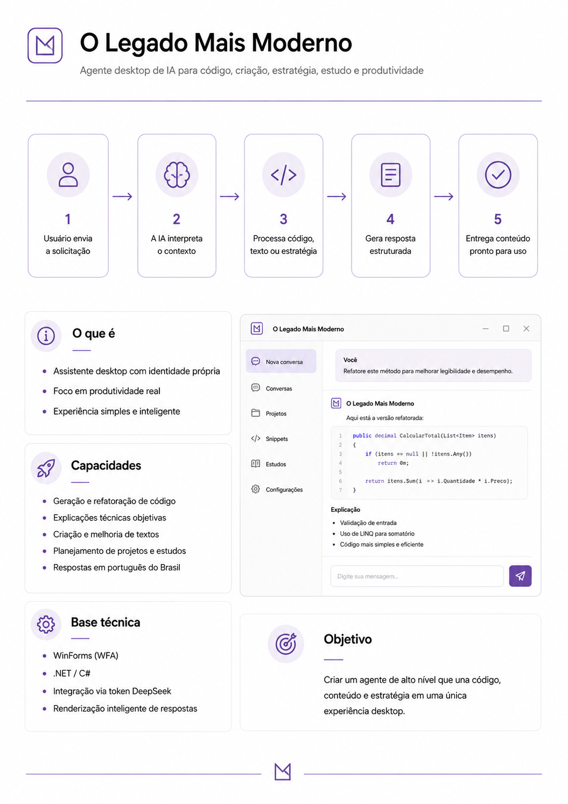

# O Legado Mais Moderno



**O Legado Mais Moderno** é um agente desktop de inteligência artificial desenvolvido em **WinForms (WFA)**, com foco em produtividade, código, criação de textos, estratégia, estudos e organização de projetos.

O projeto nasceu com a proposta de modernizar uma aplicação desktop tradicional, criando uma experiência simples, direta e inteligente usando integração com IA via API da DeepSeek.

---

## Visão geral

O sistema funciona como um assistente local para apoiar o usuário em tarefas do dia a dia, principalmente em contextos de desenvolvimento, escrita, estudo e planejamento.

A ideia central é unir uma interface desktop simples com um agente de IA capaz de interpretar solicitações, gerar respostas estruturadas e formatar automaticamente conteúdos técnicos, como blocos de código.

---

## Objetivo

Criar um agente de alto nível que una **código, conteúdo e estratégia** em uma única experiência desktop.

O foco do projeto é entregar uma ferramenta prática, leve e evolutiva, mantendo compatibilidade com ambientes legados e tecnologias tradicionais como **WinForms** e **C#**.

---

## Funcionalidades

- Chat com agente de IA.
- Integração com DeepSeek via token.
- Histórico de conversa durante a sessão.
- Renderização inteligente de respostas.
- Formatação automática de blocos de código.
- Suporte a respostas técnicas em português do Brasil.
- Interface desktop simples e objetiva.
- Atalho `CTRL + ENTER` para envio rápido.
- Tratamento básico de erros de API e token.

---

## Fluxo de funcionamento

O fluxo principal do sistema segue uma lógica simples:

```txt
Usuário envia a solicitação
        ↓
A IA interpreta o contexto
        ↓
Processa código, texto ou estratégia
        ↓
Gera resposta estruturada
        ↓
Entrega conteúdo pronto para uso
```

---

## Stack utilizada

- **C#**
- **WinForms / WFA**
- **.NET**
- **DeepSeek API**
- **Newtonsoft.Json**
- **HttpClient**

---

## Estrutura do projeto

```txt
OLegadoMaisModerno
│
├── Forms
│   ├── FrmPrincipal.cs
│   └── FrmPrincipal.Designer.cs
│
├── Services
│   ├── IAService.cs
│   └── DeepSeekClient.cs
│
├── Models
│   ├── ChatMessage.cs
│   ├── DeepSeekRequest.cs
│   └── DeepSeekResponse.cs
│
└── Program.cs
```

---

## Configuração do token DeepSeek

Para o projeto funcionar, é necessário configurar uma variável de ambiente chamada:

```txt
DEEPSEEK_API_KEY
```

No Windows:

1. Pesquise por **Variáveis de Ambiente**.
2. Acesse **Editar as variáveis de ambiente do sistema**.
3. Clique em **Variáveis de Ambiente**.
4. Em **Variáveis de usuário**, clique em **Novo**.
5. Adicione:

```txt
Nome da variável: DEEPSEEK_API_KEY
Valor da variável: sua_chave_da_deepseek
```

Depois disso, feche e abra o Visual Studio novamente para que a variável seja reconhecida.

---

## Como executar

1. Clone o repositório:

```bash
git clone https://github.com/seu-usuario/o-legado-mais-moderno.git
```

2. Abra a solução no Visual Studio.

3. Restaure os pacotes NuGet.

4. Instale o pacote necessário, caso ainda não esteja instalado:

```powershell
Install-Package Newtonsoft.Json
```

5. Configure a variável de ambiente `DEEPSEEK_API_KEY`.

6. Execute o projeto.

---

## Exemplos de uso

Alguns exemplos de comandos que podem ser enviados ao agente:

```txt
Refatore esse método para melhorar legibilidade e desempenho.
```

```txt
Gere uma classe C# completa para representar um cliente.
```

```txt
Explique esse código de forma objetiva.
```

```txt
Crie um plano de estudos para aprender WinForms e APIs.
```

---

## Roadmap

### Versão atual

- Chat funcional com IA.
- Integração com DeepSeek.
- Interface desktop inicial.
- Renderização de blocos de código.
- Tratamento básico de erro para token e API.

### Próximas melhorias

- Salvar histórico local.
- Criar múltiplas conversas.
- Adicionar modos de agente.
- Criar tela de configurações.
- Permitir configurar token pela interface.
- Melhorar visual da aplicação.
- Adicionar exportação de respostas.
- Suporte a leitura de arquivos.
- Criar instalador Windows.

---

## Status do projeto

Projeto em desenvolvimento.

A versão atual é um **MVP funcional** com foco em validar a experiência principal do agente desktop.

---

## Autor

Desenvolvido por **Thomas Felipe**.

---

## Licença

Este projeto está em fase inicial de desenvolvimento. A licença será definida futuramente.
